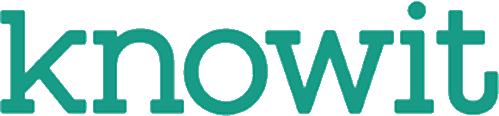

# Praktisk informasjon

Som en del av intervjuprosessen i Knowit benytter vi tekniske oppgaver. Disse oppgavene er ment som et hjelpemiddel for oss til å se hvordan våre kandidater tenker analytisk og angriper problemstillinger. Oppgavene er kun overordnet beskrevet slik at det er stor frihet i hvordan besvarelsen presenteres. Still gjerne forutsetninger der du føler for det.

Under intervjuet vil vi be deg presentere besvarelsen og forklare hva du har tenkt.

Eksempler på virkemidler i tillegg til tekst:

-   Flytdiagram
-   Kode
-   Skisser (f.eks i Visio)

Oppgave 3 leveres som kode og deles gjennom f.eks. github minst 24 timer før intervjuet.

Vi ser for oss at kandidater bruker ca. 3-5 timer på å ferdigstille oppgavene.

Selve intervjuet varer som regel rundt 1,5 time.

## Oppgave 1 – Vis oss noe du har erfaring med

Fortell oss om et verktøy, en stack eller en plattform på frontendsiden du har brukt før, prat litt om hvorfor vi burde, eller ikke burde bruke dette.

Forslag til nøkkelpunkter du kan prate rundt:

-   Pros/Cons, hvilket problem man løser med dette.
-   Eventuelle utfordringer man støtte på som følge av valget.
-   Ting du personlig likte, og/eller fant utfordrende med å bruke dette.
-   Hvordan den endelige løsningen målte opp til problemet man ville løse.

## Oppgave 2 – Bookingløsning

Din kunde, et padelsenter, ønsker seg en løsning for å kunne administrere reservasjoner av senterets baner.

Hvilke typer roller/personer ser du for deg trenger å bruke systemet og hvordan bruker rollene systemet?

Beskriv en løsning av systemet. Ta også med vurderinger rundt valg av plattform og teknologi.

Hvilke nye muligheter vil et slikt system gi for ledelsen av senteret?

## Oppgave 3 – Integrasjonstjeneste

Kunden du jobber for ønsker at du skal utvikle en ny integrasjonstjeneste. Tjenesten skal tilgjengeliggjøre diverse _begreper_. Den skal erstatte en eldre eksisterende løsning og må derfor gi ut data på samme format. Tjenesten skal hente data fra en intern tjeneste som leverer data på et internt format.

I denne oppgaven skal du sett opp en REST-applikasjon som integreres mot en intern tjeneste.


#### Oppsett av intern tjeneste
Vi bruker docker-compose for å sette opp tjenesten som du skal integrere mot.

Gjør følgende:

1. Installere docker-desktop eller manuelt installer det som trengs på din maskintype:
   https://www.docker.com/products/docker-desktop/
2. Kjør bash eller powershell filen [build_and_run](../Backend/build_and_run.sh).
   (Denne bygger test api'et og så tar opp sql databasen og api'et)

Swagger dokumentasjonen for tjenesten kan hentes på http://localhost:8080/apidocs/.
For å hente ut alle begrep så kan man sende en POST-request til `localhost:8080/concepts`. Send med body `{ page: 1 }` for å hente neste side.

#### Utvikling av ny tjeneste

Lag en integrasjonstjeneste som tilbyr informasjon om _begreper_. Begrepene skal hentes fra den interne tjenesten og tilbys som angitt under.
Du kan selv velge teknologi og rammeverk, men gi gjerne en begrunnelse for valgene.

Tjenesten skal tilby følgende endepunkter:

`/begrep`  
Endepunkt som leverer en liste med alle begreper

`/begrep/{id}`  
Endepunkt som leverer ett begrep med angitt id.

Det forventes at endepunktene skal tilby begreper med følgende JSON-format:
```yaml
{
   "id": string,
   "subject": string,
   "prefLabel": string,
   "altLabel": string,
   "definition": { 
      "tekst": string,
      "lastUpdated": date 
   }
}
```
